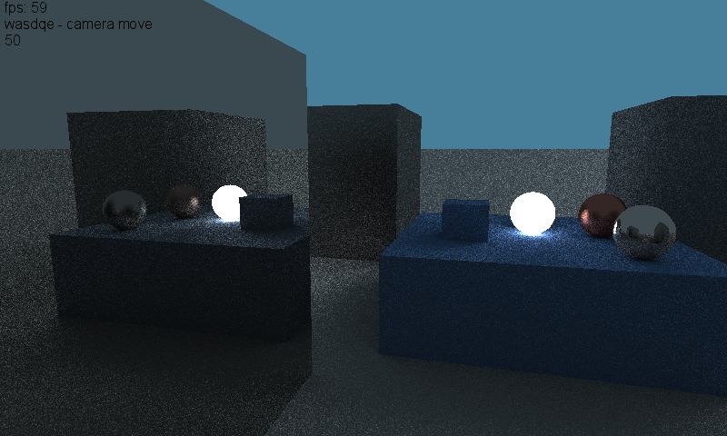
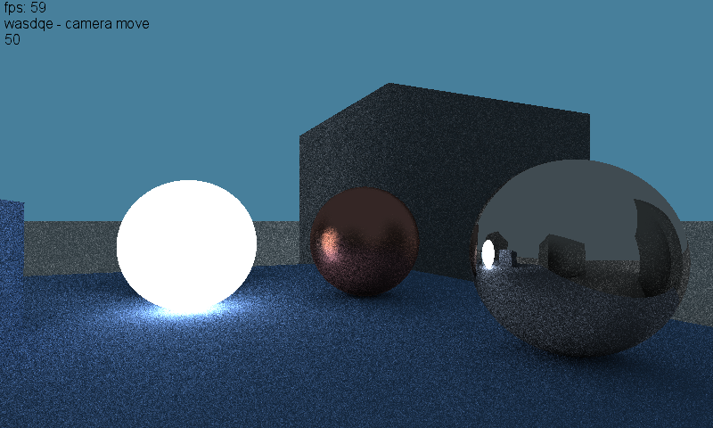
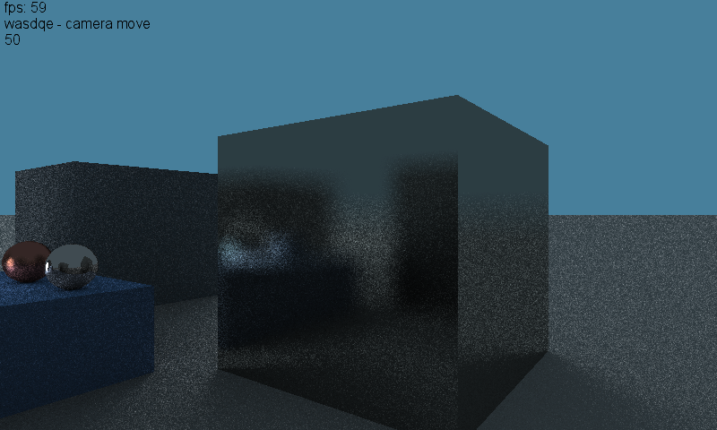

# Ray-tracing
3д графика с регулируемыми параметрами отражения материалов и их светимости и цвета.
Написана с нуля в шейдере на Monogame, хотя схожим образом реализуется на чистом OpenGL или sdl2

